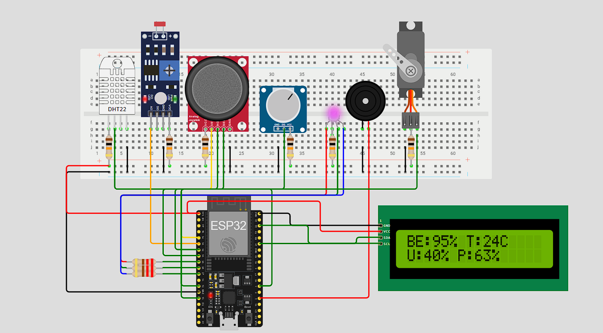

# 🧠 Projeto SYNAPSE IoT Hub - Global Solution 2025
**Tema:** O Futuro do Trabalho

---

## 👥 Integrante

* **Nome:** Matheus Henrique Ferreira Camargo da Silva
* **RM:** 566232

---

## 🎥 Link para o Vídeo
O vídeo de demonstração do sistema SYNAPSE em funcionamento está disponível no link abaixo:

> **[https://youtu.be/StYkkS0g9gc](https://youtu.be/StYkkS0g9gc)**

---

## 🔗 Link para Simulação no Wokwi
A simulação completa do circuito e código do projeto está disponível aqui:

> **[https://wokwi.com/projects/447707571855388673](https://wokwi.com/projects/447707571855388673)**

---

## 🎯 O Problema

O futuro do trabalho traz grandes desafios, entre eles o impacto negativo de ambientes inadequados e altos níveis de estresse e fadiga na produtividade e saúde dos trabalhadores remotos e híbridos.  

A lacuna entre as condições ideais de trabalho e a realidade provoca queda no bem-estar, insatisfação e até problemas de saúde.

O SYNAPSE IoT Hub propõe uma solução integrada para monitorar continuamente as condições ambientais e pessoais do trabalhador, com o objetivo de antecipar e mitigar essas dificuldades.

---

## 💡 A Solução Desenvolvida: SYNAPSE IoT Hub

O sistema utiliza um microcontrolador ESP32 que lê vários sensores:

- DHT22 para temperatura e umidade ambiental.
- Sensor LDR para medir o nível da luminosidade.
- Joystick analógico para avaliar energia e fadiga do usuário.
- Potenciômetro para medir produtividade.
- Botão simulado para nível de estresse.

Os atuadores são:

- LED RGB que indica o score de bem-estar por cores (verde, amarelo, vermelho).
- Buzzer que dispara alertas sonoros em situações críticas.
- Servo motor que simula controle de ventilação ambiental.
- Display LCD I2C para mostrar valores e status em tempo real.

O sistema calcula um score de bem-estar baseado nessas variáveis e apresenta as informações visualmente no LCD e aciona LEDs, buzzer e servo conforme necessidade.

Além disso, uma simulação do protocolo MQTT envia os dados via saída Serial para facilitar a integração e testes em ambientes simulados como o Wokwi.

---

## 🔧 Estrutura do Projeto

- Código principal em `SYNAPSE_IoT_Hub.ino`, organizado em:
  - Configurações de pinos e bibliotecas.
  - Leitura e interpretação dos sensores.
  - Cálculo do score de bem-estar.
  - Atualização de display LCD.
  - Controle dos atuadores (LED RGB, buzzer, servo).
  - Simulação da comunicação MQTT via Serial.
  - Funções auxiliares para reconexão e interação MQTT.

O código está amplamente comentado para facilitar entendimento e modificações.

---

## 📡 Comunicação MQTT Simulada

Devido à limitação do ambiente Wokwi, a comunicação MQTT é simulada via console Serial. Os tópicos são os seguintes:

| Tópico                          | Descrição                       |
|--------------------------------|--------------------------------|
| synapse/bem-estar/user_001/score   | Score geral de bem-estar          |
| synapse/ambiente/user_001/temp      | Temperatura ambiente             |
| synapse/ambiente/user_001/umidade   | Umidade ambiente                |
| synapse/ambiente/user_001/luz       | Luminosidade                   |
| synapse/produtividade/user_001/prod | Produtividade atual             |
| synapse/command/user_001/+          | Simulação de comandos remotos  |

Esses dados podem ser enviados periodicamente da simulação para sistemas reais de monitoramento em uma futura versão com hardware físico.

---

## 🔌 Circuito e Conexões

O circuito conecta:

- DHT22 ao GPIO4
- LDR ao GPIO35 (ADC)
- Joystick aos GPIO34 (X) e GPIO33 (Y)
- Potenciômetro ao GPIO32 (ADC)
- LED RGB nos GPIO25 (R), GPIO26 (G) e GPIO27 (B)
- Buzzer ao GPIO2
- Servo Motor ao GPIO13
- Display LCD I2C nos GPIO21 (SDA) e GPIO22 (SCL)

---

## ✅ Requisitos e Dependências

- Biblioteca DHT para sensor de temperatura e umidade.
- Biblioteca LiquidCrystal_I2C para controle do LCD.
- Biblioteca ESP32Servo para o servo motor.
- Ambiente de desenvolvimento Arduino para ESP32.
- Simulação via Wokwi (link fornecido).

---

## 🚀 Como Usar o Projeto

1. Abra o projeto no Wokwi através do link disponibilizado.
2. Carregue o código fonte principal `Codigo.ino`.
3. Observe o LCD exibindo os dados em tempo real.
4. Experimente variar o potenciômetro e o joystick para ver as atualizações instantâneas no display e o efeito no LED RGB.
5. Ajuste as variáveis ambientais para visualizar as ações do buzzer e do servo motor.
6. Acompanhe no console Serial as mensagens MQTT simuladas para entender a comunicação de dados.

---

## 💡 Impacto e Aplicações

O SYNAPSE IoT Hub oferece uma solução prática para monitoramento de bem-estar no ambiente de trabalho, contribuindo para a saúde, produtividade e satisfação dos trabalhadores. Pode ser pesquisado e expandido para integração em ambientes inteligentes e plataformas corporativas.

---

## 📄 Arquivos Fonte

- `Codigo.ino` - Código fonte principal devidamente comentado.

---

**SYNAPSE IoT Hub - Conectando dados para um futuro do trabalho melhor.**
